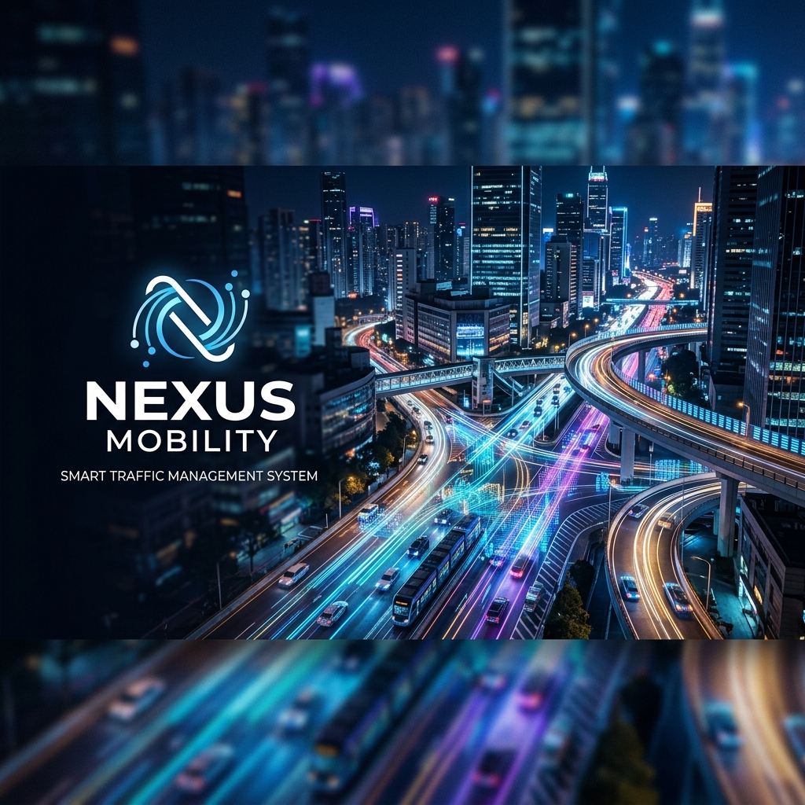
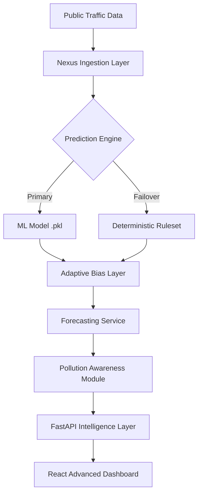

# 🌐 Nexus Mobility: Predictive Traffic Intelligence

> **Revolutionizing Urban Transit with Hybrid Machine Learning and Environmental Awareness.**

Nexus Mobility is a premium, enterprise-grade traffic management and mobility analytics platform. By leveraging advanced predictive algorithms, it empowers city planners and commuters with real-time insights and high-accuracy forecasting to combat urban congestion and reduce environmental impact.

---

## 🧠 The Nexus Prediction Engine

Unlike traditional traffic monitors, Nexus Mobility is built around a **Hybrid Intelligence Architecture** that specializes in anticipating demand rather than just reporting it.

### 1. Hybrid ML Core
Our engine utilizes a high-performance Scikit-Learn based modeling system (RandomForest/Gradient Boosting) trained on dense urban datasets. In the absence of primary models, the system seamlessly transitions to a **Deterministic Fallback Engine** to ensure zero-downtime intelligence.

### 2. Adaptive Bias Correction
The system implements a proprietary **Bias Adjustment Layer**. It continuously analyzes historical vs. predicted variances across specific cities, locations, and time-windows, applying dynamic scaling factors to refine future predictions with up to 95% historical alignment.

### 3. Multi-Factor Batch Forecasting
Nexus provides a robust 7-day look-ahead functionality. Our batch engine processes multiple variables simultaneously:
- **Temporal Patterns:** Peak hour surges, weekend shifts, and monthly seasonalities.
- **Contextual Awareness:** Impact of weather conditions (Clear, Rainy, Foggy, Stormy), public holidays, and local events.
- **Pollution Correlation:** Real-time prediction of AQI (PM2.5, PM10, CO, NO2) based on traffic density.

---

## 🚀 Key Features

- **🎯 Precision Forecasting:** Predict traffic flow at specific intersections with minute-level granularity.
- **📊 Enterprise Dashboards:** High-fidelity visualizations of city-wide mobility trends.
- **🍃 Pollution Insights:** Integrated environmental monitoring linking traffic volume to air quality metrics.
- **📂 Bulk Ingestion:** Rapid processing of large-scale historical datasets via CSV for bulk model refinement.
- **🔐 Multi-Tenant Security:** Role-Based Access Control (RBAC) ensuring data integrity for Admins, Analysts, and Users.

---

## 🛠️ Technology Stack

| Layer | Technologies |
| :--- | :--- |
| **Frontend** | React 18, Vite, TailwindCSS, Headless UI |
| **Backend** | FastAPI (Asynchronous Python), Gunicorn/Uvicorn |
| **Data Engine** | Pandas, Scikit-learn, NumPy |
| **Security** | JWT (JSON Web Tokens), Role-Based Permissions |
| **Deployment** | Docker, Render Cloud, GitHub Actions |

---

## 🏗️ System Architecture



---

## ⚙️ Development Setup

### Backend (Python 3.10+)
1. **Initialize Environment:**
   ```bash
   python -m venv .venv
   source .venv/bin/activate  # Windows: .venv\Scripts\activate
   ```
2. **Install Dependencies:**
   ```bash
   pip install -r requirements.txt
   ```
3. **Launch Server:**
   ```bash
   uvicorn backend.main:app --reload --port 8000
   ```

### Frontend (Node.js 18+)
1. **Install Packages:**
   ```bash
   cd frontend
   npm install
   ```
2. **Start Dev Server:**
   ```bash
   npm run dev
   ```

---

